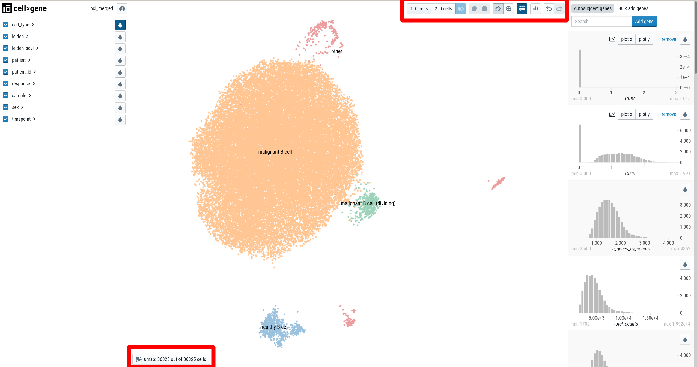
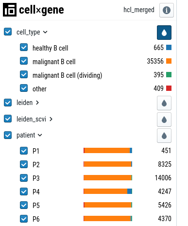
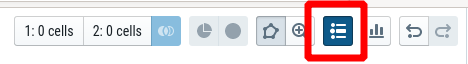
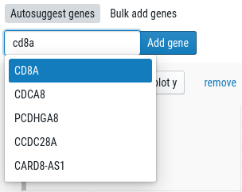
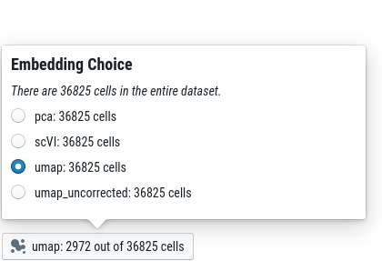
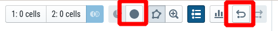

# Cell-x-gene user guide

[cell-x-gene](https://chanzuckerberg.github.io/cellxgene/) is a single-cell visualization platform
developed by the [Chan-Zuckerberg initative](https://chanzuckerberg.com/). It allows
to explore single-cell RNA-seq (scRNA-seq) datasets in the web browser without any 
computational skills. This guide gives an overview of the most important features. 

- [Cell-x-gene user guide](#cell-x-gene-user-guide)
	- [Portal overview](#portal-overview)
	- [How to color by categorical variables (cell-type, patient, etc.)](#how-to-color-by-categorical-variables-cell-type-patient-etc)
	- [How to color by gene](#how-to-color-by-gene)
	- [How to change the embedding](#how-to-change-the-embedding)
	- [How to analyse a subset of data (e.g. specific cell-type or patient)](#how-to-analyse-a-subset-of-data-eg-specific-cell-type-or-patient)
	- [How to perform differential gene expression analysis](#how-to-perform-differential-gene-expression-analysis)

## Portal overview

  

The portal consists of three main panels: 

 * the left sidebar for *categorical annotations*, such as patient, cell-type, ...
 * the main panel, visualizing a *embedding* of the single-cells (usually [UMAP](https://www.nature.com/articles/nbt.4314)). 
 * the right sidebar for *continuous variables*, such as genes. 

Additionally, there are two toolbars: 
 * The "main toolbar" at the right top
 * the "embedding toolbar" at the bottom left.

## How to color by categorical variables (cell-type, patient, etc.)

In the left sidebar, click on the drop next to a variable. 
If you open another category ("patient" in the example), you'll see colorbars
indicating the distribution of the category. 

  

For some variables (cluster, cell-type) it makes sense to overlay the 
legend on the cell-type plot. To activate this feature, click on the "show labels" 
button in the toolbar: 

  

## How to color by gene

In the right sidebar, enter a gene in the "Search" bar. 

  

This will add a histogram to the right sidebar. Click on the drop to color the 
single-cell plot by the gene expression: 

## How to change the embedding

For some datasets, we provide multiple embeddings (usually, that is a UMAP with and
without batch correction, respectively). You can choose the embedding from the
"embedding toolbar" at the bottom left: 

  

## How to analyse a subset of data (e.g. specific cell-type or patient)

There are different ways to select cells in cell-x-gene:

1. By selecting categories in the left sidebar
   
2. Using drag&drop on the plot

3. By selecting a range in the right sidebar

Once you selected cells, you remove all other cells from the plot by clicking on the 
"Subset" button in the toolbar: 

  

To reset the view to include all cells, use the "Undo subset" button. You can also 
undo a single step by using the "undo" button: 

  

## How to perform differential gene expression analysis

With cell-x-gene it is possible to perform a very simple differential gene expression 
(DE)-analysis. It does not correct for any biases and only shows the top 10 most 
differentially expressed genes. This is great for a first glance at the data - if you 
need a more in-depth analysis, contact your Bioinformaticians. 

TODO

